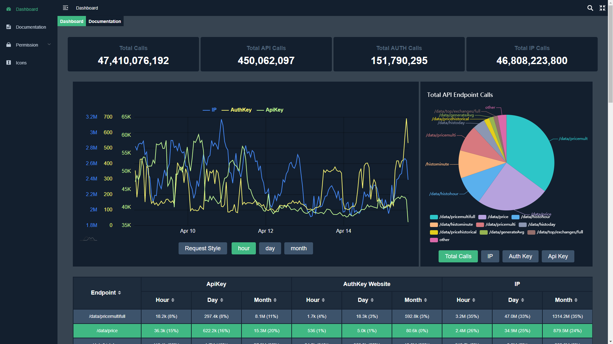

## Introduction

This is an example dashboard I made which connected to cryptocompare API endpoints and then displayed the data in a 
clearer way. I modified a free front-end management background integration solution [vue-element-admin] to create it. 
For the charts i used echarts for the pie chart, and am-charts4 for the graphs.
Its been modified to only run from dev mode. 

## Running the dashboard

install dependencies : npm install

develop : npm run dev

This will automatically open http://localhost:9527.
